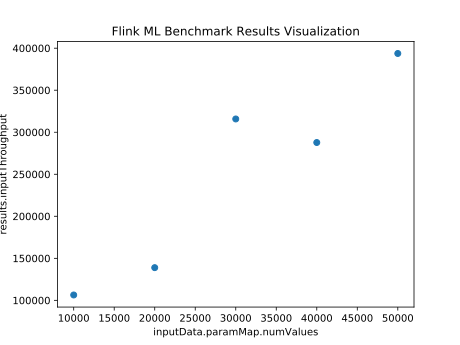

# Flink ML Benchmark Getting Started

This document provides instructions on how to run benchmarks on Flink ML's
stages in a Linux/MacOS environment.

## Prerequisites

### Install Flink

Please make sure Flink 1.17 or higher version has been installed in your local
environment. You can refer to the [local
installation](https://nightlies.apache.org/flink/flink-docs-master/docs/try-flink/local_installation/)
instruction on Flink's document website for how to achieve this.

### Set Up Flink Environment Variables

After having installed Flink, please register `$FLINK_HOME` as an environment
variable into your local environment.

```bash
cd ${path_to_flink}
export FLINK_HOME=`pwd`
```

[//]: # (TODO: Add instructions to download binary distribution when release is
    available)
### Build Flink ML library

In order to use Flink ML's CLI you need to have the latest binary distribution
of Flink ML. You can acquire the distribution by building Flink ML's source code
locally with the following command.

```bash
cd ${path_to_flink_ml}
mvn clean package -DskipTests
cd ./flink-ml-dist/target/flink-ml-*-bin/flink-ml*/
```

### Add Flink ML binaries to Flink

You need to copy Flink ML's binary distribution files to Flink's folder for
proper initialization. Please run the following command from Flink ML's binary
distribution's folder.

```bash
cp ./lib/*.jar $FLINK_HOME/lib/
```

## Run Benchmark Example

Please start a Flink standalone cluster in your local environment with the
following command.

```bash
$FLINK_HOME/bin/start-cluster.sh
```

You should be able to navigate to the web UI at
[localhost:8081](http://localhost:8081/) to view the Flink dashboard and see
that the cluster is up and running.

Then in Flink ML's binary distribution's folder, execute the following command
to run the default benchmarks.

```bash
./bin/benchmark-run.sh conf/benchmark-demo.json --output-file results.json
```

You will notice that some Flink jobs are submitted to your Flink cluster, and
the following information is printed out in your terminal. This means that you
have successfully executed the default benchmarks.

```
Found 8 benchmarks.

...

Benchmarks execution completed.
Benchmark results saved as json in results.json.
```

The command above would save the results into `results.json` as a map. For a
successfully executed benchmark, a map entry of the following format would be
added.

```json
{
  "KMeans-1" : {
    "stage" : {
      "className" : "org.apache.flink.ml.clustering.kmeans.KMeans",
      "paramMap" : {
        "featuresCol" : "features",
        "predictionCol" : "prediction"
      }
    },
    "inputData" : {
      "className" : "org.apache.flink.ml.benchmark.datagenerator.common.DenseVectorGenerator",
      "paramMap" : {
        "seed" : 2,
        "colNames" : [["features"]],
        "numValues" : 10000,
        "vectorDim" : 10
      }
    },
    "results" : {
      "totalTimeMs" : 7148.0,
      "inputRecordNum" : 10000,
      "inputThroughput" : 1398.9927252378288,
      "outputRecordNum" : 1,
      "outputThroughput" : 0.13989927252378287
    }
  }
}
```

If a benchmark failed, it would be saved in the file as follows.

```json
{
  "Unmatch-Input" : {
    "stage" : {
      "className" : "org.apache.flink.ml.clustering.kmeans.KMeans",
      "paramMap" : {
        "featuresCol" : "features",
        "predictionCol" : "prediction"
      }
    },
    "inputData" : {
      "className" : "org.apache.flink.ml.benchmark.datagenerator.common.DenseVectorGenerator",
      "paramMap" : {
        "seed" : 2,
        "colNames" : [["non-features"]],
        "numValues" : 10000,
        "vectorDim" : 10
      }
    },
    "results" : {
      "exception" : "java.lang.NullPointerException(ReadWriteUtils.java:388)"
    }
  }
}
```

## Advanced Topics

### Customize Benchmark Configuration

`benchmark-run.sh` parses benchmarks to be executed according to the input
configuration file, like `conf/benchmark-demo.json`. It can also parse your
custom configuration file so long as it contains a JSON object in the following
format.

- The file should contain the following as the metadata of the JSON object.
  - `"version"`: The version of the json format. Currently its value must be 1.
- Keys in the JSON object, except `"version"`, are regarded as the names of the
  benchmarks.
- The value of each benchmark name should be a JSON object containing the
  following keys.
  - `"stage"`: The stage to be benchmarked.
  - `"inputs"`: The input data of the stage to be benchmarked.
  - `"modelData"`(Optional): The model data of the stage to be benchmarked, if
    the stage is a `Model` and needs to have its model data explicitly set.
- The value of `"stage"`, `"inputs"` or `"modelData"` should be a JSON object
  containing the following keys.
  - `"className"`: The full classpath of a `WithParams` subclass. For `"stage"`,
    the class should be a subclass of `Stage`. For `"inputs"` or `"modelData"`,
    the class should be a subclass of `DataGenerator`.
  - `"paramMap"`: An optional JSON object containing the parameters related to
    the specific `Stage` or `DataGenerator`, overriding default values for the
    parameters.

Combining the format requirements above, an example configuration is as follows.
This configuration contains two benchmarks. The first benchmark name is
"KMeans-1", and is executed on `KMeans` stage. The stage is benchmarked against
10000 randomly generated vectors.

```json
{
  "version": 1,
  "KMeans-1": {
    "stage": {
      "className": "org.apache.flink.ml.clustering.kmeans.KMeans",
      "paramMap": {
        "featuresCol": "features",
        "predictionCol": "prediction"
      }
    },
    "inputData": {
      "className": "org.apache.flink.ml.benchmark.datagenerator.common.DenseVectorGenerator",
      "paramMap": {
        "seed": 2,
        "colNames": [["features"]],
        "numValues": 10000,
        "vectorDim": 10
      }
    }
  },
  "KMeansModel-1": {
    "stage": {
      "className": "org.apache.flink.ml.clustering.kmeans.KMeansModel",
      "paramMap": {
        "featuresCol": "features",
        "k": 2,
        "distanceMeasure": "euclidean",
        "predictionCol": "prediction"
      }
    },
    "modelData":  {
      "className": "org.apache.flink.ml.benchmark.datagenerator.clustering.KMeansModelDataGenerator",
      "paramMap": {
        "seed": 1,
        "arraySize": 2,
        "vectorDim": 10
      }
    },
    "inputData": {
      "className": "org.apache.flink.ml.benchmark.datagenerator.common.DenseVectorGenerator",
      "paramMap": {
        "seed": 2,
        "colNames": [["features"]],
        "numValues": 10000,
        "vectorDim": 10
      }
    }
  }
}
```

### Benchmark Results Visualization

`benchmark-results-visualize.py` is provided as a helper script to visualize
benchmark results. For example, we can visualize the benchmark results generated
in `results.json` as follows.

```shell
python3 ./bin/benchmark-results-visualize.py results.json --pattern "^KMeansModel.*$"
```

This command selects all benchmark results whose names start with `KmeansModel`
and visualizes their `inputThroughput` against `numValues` as below. It is clear
from this plot that in our example environment, when number of data is small,
the algorithm's throughput is positively correlated to the number of data.


